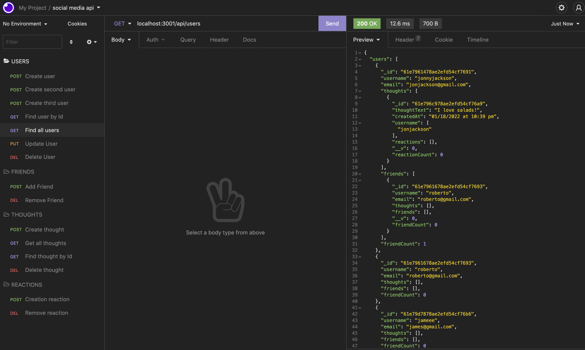
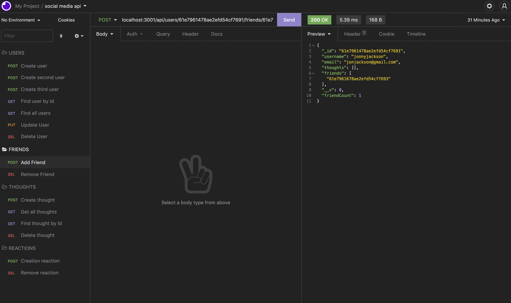
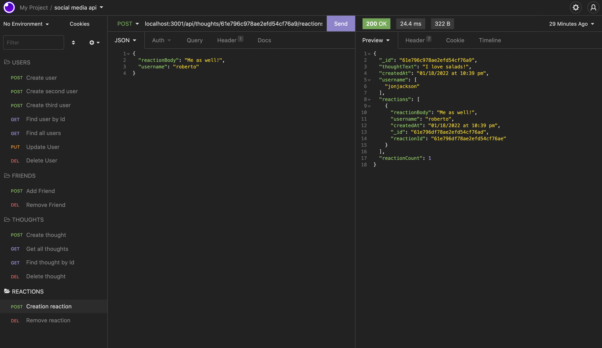

# NoSQL: Social Network API

<a name="description"></a>
## Description
The purpose of this API was to create a backend system that handles CRUD operations for a social media network in order to manage a user database, with friends lists, thoughts, and reactions.  


[](https://opensource.org/licenses/MIT)

## Table of Contents
- [Description](#description)
- [User Story](#userstory)
- [Acceptance Criteria](#acceptancecriteria)
- [Installation](#installation)
- [Usage](#usage)
- [License](#license)
- [Contributing](#contributing)
- [Tests](#tests)
- [Questions](#questions)
- [Video](#video)
- [Screenshots](#screenshots)
- [Links](#links)
- [Resources / Credits](#credits)


<a name="userstory"></a>

## User Story

```md
AS A social media startup
I WANT an API for my social network that uses a NoSQL database
SO THAT my website can handle large amounts of unstructured data
```

<a name="acceptancecriteria"></a>

## Acceptance Criteria

```md
GIVEN a social network API
WHEN I enter the command to invoke the application
THEN my server is started and the Mongoose models are synced to the MongoDB database
WHEN I open API GET routes in Insomnia for users and thoughts
THEN the data for each of these routes is displayed in a formatted JSON
WHEN I test API POST, PUT, and DELETE routes in Insomnia
THEN I am able to successfully create, update, and delete users and thoughts in my database
WHEN I test API POST and DELETE routes in Insomnia
THEN I am able to successfully create and delete reactions to thoughts and add and remove friends to a user’s friend list
```

<a name="installation"></a>

## Installation
* Clone the repository using:

```
git clone https://github.com/jonteal/social-network-api
```
* Be sure that you are in the current working directory
* Create a .env file. (See below in Usage for how to set up.)
* Install the dependencies (express, mongoose, and moment) by opening the terminal and running...
```
npm install OR npm i
```

* Next, run the project by typing the following command in the terminal:
```
npm run dev
```

<a name="usage"></a>

## Usage
* In order to use the application, the user needs to use an API client such as Insomnia, or any other similar tool. Routes for the Users, Friends, Thoughts, and Reactions below:

### User Routes

* Create User (Must create with JSON body with username & email)
```
localhost:3001/api/users/
```
* Find User by Id
```
localhost:3001/api/users/:userId
```
* Find all Users
```
localhost:3001/api/users
```
* Update User (Must update with JSON body)
```
localhost:3001/api/users/:userId
```
* Delete User
```
localhost:3001/api/users/:userId
```

### Friends
* Add Friend - (1st userId adds 2nd userId to friends list)
```
localhost:3001/api/users/:userId/friends/:userId
```
* Remove Friend - (1st userId removes 2nd userId from friends list)
```
localhost:3001/api/users/:userId/friends/:userId
```

### Thoughts 
* Create Thought - (create using JSON body with userID, thoughtText, and username)
```
localhost:3001/api/thoughts/
```
* Get all Thoughts
```
localhost:3001/api/thoughts/
```
* Find Thought by Id
```
localhost:3001/api/thoughts/:thoughtId
```
* Delete Thought
```
localhost:3001/api/thoughts/:thoughtId
```

### Reactions
* Create Reaction - (create with JSON body using reactionBody and username)
```
localhost:3001/api/thoughts/:thoughtId/reactions
```
* Remove Reaction
```
localhost:3001/api/thoughts/:thoughtId/reactions/:reactionId
```


<a name="license"></a>

## License
Permission is hereby granted, free of charge, to any person obtaining a copy of this software and associated documentation files (the "Software"), to deal in the Software without restriction, including without limitation the rights to use, copy, modify, merge, publish, distribute, sublicense, and/or sell copies of the Software, and to permit persons to whom the Software is furnished to do so, subject to the following conditions:

The above copyright notice and this permission notice shall be included in all copies or substantial portions of the Software.

THE SOFTWARE IS PROVIDED "AS IS", WITHOUT WARRANTY OF ANY KIND, EXPRESS OR IMPLIED, INCLUDING BUT NOT LIMITED TO THE WARRANTIES OF MERCHANTABILITY, FITNESS FOR A PARTICULAR PURPOSE AND NONINFRINGEMENT. IN NO EVENT SHALL THE AUTHORS OR COPYRIGHT HOLDERS BE LIABLE FOR ANY CLAIM, DAMAGES OR OTHER LIABILITY, WHETHER IN AN ACTION OF CONTRACT, TORT OR OTHERWISE, ARISING FROM, OUT OF OR IN CONNECTION WITH THE SOFTWARE OR THE USE OR OTHER DEALINGS IN THE SOFTWARE.


<a name="contributing"></a>

## How to Contribute
1. [Fork the repo!](https://docs.github.com/en/get-started/quickstart/fork-a-repo)
2. Create a feature branch:
```
git checkout -b yourname-branch
```
3. Commit changes:
```
git commit -m 'Your changes here'
```
4. Push to the branch:
```
git push origin yourname-branch
```
5. Submit a pull request and wait for it to be approved or denied.

<a name="tests"></a>

## Tests
No tests available at this time.


<a name="questions"></a>

## Questions
If you have any questions or comments, please feel free to contact me by email:

* Jon Jackson - jonjackson.webdesign@gmail.com


<a name="video"></a>

## Walkthrough Video

https://drive.google.com/file/d/1p7S7dpKVjFKy7YuUSeqiwN78qRQsUY7L/view

<a name="screenshots"></a>

## Screenshots


#### Users


#### Friends


#### Thoughts and Reactions



<a name="links"></a>

## Links
Github Repository: https://github.com/jonteal/social-network-api


<a name="credits"></a>

## Resources / Credits
This project was authored by: 
* Jon Jackson - https://github.com/jonteal

Development of the project utilized npm dependencies: express, moment, and mongoose and MongoDB for the database.